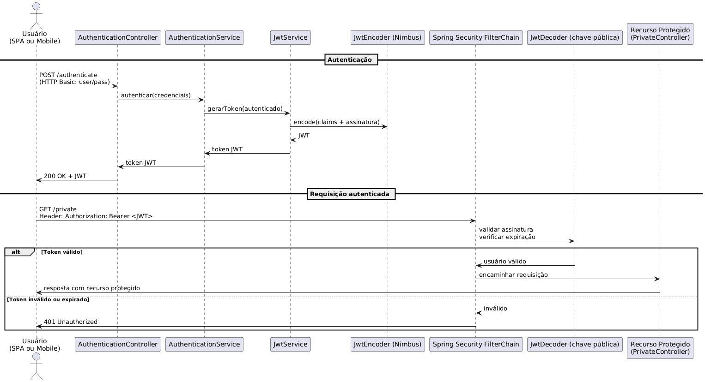

## 1. Introdução à Segurança em APIs REST

A segurança de APIs RESTful é um aspecto essencial no desenvolvimento de aplicações modernas, principalmente diante da crescente adoção de arquiteturas distribuídas. Uma abordagem bastante adotada para esse fim é o uso de JSON Web Tokens (JWT), padrão aberto (RFC 7519) que permite a representação segura de informações entre duas partes. O Spring Security oferece suporte nativo à autenticação baseada em JWT, dispensando a necessidade de bibliotecas externas e implementações manuais complexas. Esse suporte é viabilizado por meio do módulo OAuth2 Resource Server, que integra de forma transparente com o ecossistema Spring Boot. Antes de abordarmos a implementação do JWT com Spring Boot, entretanto, vamos entender um pouco dos fundamentos dessa tecnologia.

### 1.1. JSON Web Token (JWT): características e aplicações

O JSON Web Token (JWT) é um padrão aberto (RFC 7519) que define uma forma **compacta e auto-contida** de transmitir informações seguras entre partes como um objeto JSON ([JSON Web Token Introduction - jwt.io](https://jwt.io/introduction#:~:text=JSON%20Web%20Token%20,pair%20using%20RSA%20or%20ECDSA)). Internamente, um JWT (tipicamente no formato JWS – JSON Web Signature) é composto por três segmentos codificados em Base64URL, separados por pontos: um **cabeçalho** (header), um **payload** (carga útil) e uma **assinatura** ([Stateless Sessions for Stateful Minds: JWTs Explained and How You Can Make The Switch](https://auth0.com/blog/stateless-auth-for-stateful-minds/#:~:text=,validated%20against%20tampering%20using%20this)). O cabeçalho contém metadados sobre o token (por exemplo, `{ "alg":"HS256", "typ":"JWT"}`), enquanto o payload guarda declarações (“claims”) sobre a entidade (usuário) ou o token (como identificador de usuário, papéis, escopos, data de emissão/expiração, etc.) ([A Beginner's Guide to JWTs | Okta Developer](https://developer.okta.com/blog/2020/12/21/beginners-guide-to-jwt#:~:text=A%20JWT%20is%20a%20structured,are%20two%20types%20of%20JWTs)). A assinatura criptográfica, calculada sobre o cabeçalho e o payload, garante que o token não foi alterado e que foi emitido por uma fonte confiável ([JSON Web Token Introduction - jwt.io](https://jwt.io/introduction#:~:text=JSON%20Web%20Token%20,pair%20using%20RSA%20or%20ECDSA)). Opcionalmente, além de assinar (JWS), um JWT pode ser criptografado (JWE – JSON Web Encryption) para ocultar seu conteúdo de terceiros; porém, seu uso mais comum é na forma assinada, em que o payload permanece visível para quem possui o token. 

Para assinar e verificar JWT há dois modelos principais de algoritmos: simétricos e assimétricos.

Em **algoritmos simétricos** (ex.: HS256 – HMAC com SHA-256), há apenas uma chave secreta compartilhada entre as partes: o emissor do token usa esse segredo para assinar, e o destinatário usa o mesmo segredo para verificar a assinatura ([Signing Algorithms](https://auth0.com/docs/get-started/applications/signing-algorithms#:~:text=%2A%20HS256%20%28HMAC%20with%20SHA,This)).

Por outro lado, em **algoritmos assimétricos** (ex.: RS256 – assinatura RSA com SHA-256, ou algoritmos ECDSA), existe um par de chaves: o emissor mantém a chave *privada* para assinar o JWT, e os demais usam a chave *pública* correspondente para validar o token. A vantagem do RSA (ou ECDSA) é que apenas o detentor da chave privada pode emitir tokens válidos, enquanto qualquer serviço com a chave pública pode conferir a assinatura sem conhecer segredos compartilhados. Por essa razão, é geralmente recomendado usar RS256 em produção: se a chave privada for comprometida, ela pode ser rotacionada facilmente sem precisar redeploy dos serviços consumidores do token. Algoritmos simétricos (HMAC) são mais simples de implementar, mas exigem cuidado adicional para não vazar o segredo usado em múltiplas aplicações. Note-se também que JWTs suportam tanto apenas a assinatura (JWS) quanto também a criptografia de conteúdo (JWE) quando é necessário manter os dados ocultos, mas o mecanismo de assinatura é o que garante a **integridade** do token.

As principais motivações para adotar JWT decorrem de sua natureza **sem estado** (“stateless”) e padronização ampla. Como cada JWT é auto-suficiente, contendo todas as informações de autenticação/autorização necessárias, o servidor destinatário pode validar o token **localmente** (checando a assinatura) sem precisar consultar um banco de dados central a cada requisição. Isso facilita a escalabilidade horizontal de sistemas distribuídos: por não haver sessões armazenadas no servidor, vários serviços podem operar de forma independente e em paralelo, bastando compartilhar a chave de verificação. Em uma arquitetura de APIs REST, isso significa que a API receptor não precisa fazer round-trips ao provedor de identidade para checar o token, o que reduz latência e melhora desempenho. Por exemplo, provedores OAuth 2.0/OIDC costumam emitir *access tokens* no formato JWT exatamente para esse fim: o serviço de recursos (API) recebe o JWT e o valida localmente via assinatura, sem nova chamada à autoridade de autenticação. Além disso, o JWT pode carregar dados adicionais como o ID do usuário, papéis e escopos de acesso. Isso elimina várias consultas ao banco de dados na hora de autorizar ações, pois o serviço pode extrair essas informações diretamente do payload. Em outras palavras, ao embutir informações (como “claims” de autorização) no token, reduz-se a quantidade de “conversa” (chattiness) necessária no backend.

Outra motivação é a simplicidade para casos de *Single Sign-On* (SSO) e cenários *cross-domain*. O JWT é leve, baseado em JSON e independente de linguagem, de modo que pode ser transmitido entre domínios ou sistemas heterogêneos facilmente. Por exemplo, em fluxos SSO modernos um usuário pode autenticar em um domínio (ou aplicação) e então receber um JWT, que é enviado a outro domínio para comprovar a identidade sem nova entrada de credenciais. De fato, o padrão é usado amplamente em SSO devido ao seu pequeno overhead e capacidade de ser usado entre diferentes domínios. Dessa forma, JWT atende bem a casos onde múltiplos serviços ou aplicações em nuvem precisam compartilhar um mecanismo comum de autenticação sem depender de sessões centralizadas.

No dia a dia, o JWT aparece principalmente em autenticação de **APIs web** e **microsserviços**. É comum que APIs REST requeiram um token JWT no cabeçalho HTTP `Authorization: Bearer <token>` para liberar acesso a recursos protegidos. Nessas aplicações, o token indica quem é o usuário ou serviço requisitante e que permissões ele tem, e é validado em cada chamada sem criar estado no servidor. Em arquiteturas de microsserviços, o JWT facilita a **propagação de identidade** pelo sistema: um serviço que recebeu o token pode ler dele o ID do usuário ou outros dados de contexto e repassá-los a serviços downstream, sem precisar rediscutir autenticação a cada salto. Isto é útil tanto para autorizações internas entre microserviços quanto para cenários máquina-a-máquina (service-to-service), em que sistemas trocam JWTs para provar identidade e escopos de acesso. Igualmente, em fluxos OAuth/OIDC, o JWT pode aparecer tanto como access token quanto como ID token, dando suporte a logins federados em aplicações mobile, SPAs ou qualquer cliente web.

Fora do contexto de APIs, JWT também é usado em trocas de informações seguras entre servidores, aplicações móveis e bibliotecas de integração. Por exemplo, um cliente autenticado pode usar um JWT para fazer login em um sistema externo sem reenvio de senha (o token carrega a prova da autenticação prévia). Sua portabilidade e o fato de ser baseado em um padrão aberto o tornam também opção natural em soluções que exigem interoperabilidade entre diferentes empresas ou provedores de identidade.

### 1.2 Comparação com outras soluções de autenticação/autorização

Em aplicações web tradicionais, costuma-se usar **autenticação baseada em sessão** com cookies HTTP. Neste modelo stateful, o servidor gera um *session ID* (geralmente opaco) após o login, armazena os dados da sessão (ou um link a eles) internamente e envia o ID ao cliente via cookie. A cada requisição, o servidor consulta seu banco de sessões para carregar o contexto do usuário. Esse modelo permite revogar sessões instantaneamente (por exemplo, apagando a sessão no servidor) e utilizar proteções nativas de cookies (HttpOnly, SameSite, etc.), mas exige manter estado no servidor, o que pode dificultar o escalonamento horizontal. Em contraste, a autenticação baseada em tokens (como JWT) não requer armazenamento de sessão: cada requisição carrega o token autônomo, tornando o sistema **stateless**. Isso facilita a escalabilidade e a resiliência dos serviços, mas tem o custo de tornar a **revogação de sessão mais complexa**, pois o servidor não “lembra” quais tokens já emitiu – ele só valida a assinatura.

Outra comparação importante é entre **tokens JWT e tokens opacos** (como aqueles usados em algumas implementações OAuth2). Um token opaco é apenas um identificador aleatório vinculado a uma entrada no servidor de autorização; para verificar um token desse tipo é preciso fazer uma chamada de *introspecção* ao servidor que o emitiu. Em contrapartida, um JWT é *interpretável*: contém dados (claims) codificados em JSON e uma assinatura que qualquer parte confiável pode verificar localmente. Ou seja, o servidor de recursos não precisa chamar ninguém para validar um JWT – ele confia na assinatura. Como dito, isso torna a validação do JWT muito rápida (basta computar a assinatura localmente, sem acesso à rede), enquanto tokens opacos requerem um round-trip a um banco de dados ou endpoint de introspecção, o que adiciona latência. Em compensação, tokens opacos têm vantagem na revogação: basta removê-los do banco de dados e ficam inválidos imediatamente. Já para tokens JWT a revogação só ocorre quando o token expira (a menos que se crie uma lista de bloqueio), o que pode levar a atrasos indesejados . De forma resumida: JWT é **stateless e auto-contido**, facilitando autenticação distribuída sem estado compartilhado, enquanto soluções baseadas em sessão ou tokens opacos delegam a verificação a um servidor central e permitem revogação imediata em troca de maior acoplamento com esse servidor.

### 1.3 Limitações e desvantagens do JWT

Apesar das vantagens, o uso de JWT traz desvantagens importantes que devem ser consideradas. Em primeiro lugar, há a questão da **revogação e invalidação**. Como o JWT é validado apenas pela assinatura local, o servidor não sabe se o token foi tornado inválido antes de seu vencimento natural. Assim, se um token for vazado ou se o usuário tiver privilégios revogados, o JWT ainda poderá ser aceito até expirar, a não ser que se adote algum mecanismo extra (como listas negras de identificadores ou tempos de vida muito curtos). Isso torna a segurança mais frágil comparado a sessões que podem ser finalizadas pelo servidor a qualquer momento.

Além disso, os tokens JWT podem crescer de tamanho. Como carregam claims em JSON, cada requisição transporta esse peso extra. Se o payload incluir muitos dados (por exemplo, papéis extensos ou outros atributos), o tráfego de rede aumenta, podendo degradar o desempenho geral se usado de forma excessiva. Em arquiteturas de alto tráfego, isso deve ser balanceado: embora os tokens evitem ida constante ao banco de dados, tokens muito grandes podem virar gargalo de banda.

Do ponto de vista de segurança, a especificação JWT exige atenção especial. A validação de um token JWT corretamente é mais complexa do que parece – há muitas armadilhas e casos de borda. Por exemplo, já foram exploradas brechas relacionadas ao uso indevido do algoritmo `none`, que desabilita a verificação da assinatura. Portanto, recomenda-se usar bibliotecas maduras e configurá-las para aceitar apenas algoritmos esperados. Além disso, os dados no payload de um JWT assinado **não são criptografados** – qualquer servidor ou atacante que obtenha o token pode ler seu conteúdo. Assim, não se deve colocar informações sensíveis sem encriptá-las (caso se queira confidencialidade).

Também existem riscos no armazenamento dos tokens. Se um JWT for enviado ao cliente (como em uma aplicação web), armazená-lo em *localStorage* ou em JavaScript pode expor o token a ataques XSS. Por outro lado, armazenar o JWT em cookie HttpOnly evita acesso via script mas pode reintroduzir vulnerabilidade a CSRF caso não sejam adotadas contramedidas (como SameSite). Em resumo, o uso de JWT envolve um **trade-off entre segurança e desempenho**: ao facilitar operações sem estado e reduzir chamadas backend, abre espaço para novas formas de ataque se não for bem protegido. Boas práticas, como usar tokens de curta duração, algoritmos fortes, validação cuidadosa de claims (issuer, audience, expiração) e armazenamento seguro, são essenciais para mitigar esses riscos.  

### 1.4 JWT (JWS) vs JWE: assinatura e confidencialidade

Um JSON Web Token (JWT) padrão é apenas **assinado** (JWS) e codificado em Base64, mas **não criptografado**. Isso significa que qualquer um com o token pode ver seu conteúdo legível (claims) mas não pode alterá-lo sem invalidar a assinatura. Ou seja, um JWT pode ser assinado (JWS) ou encriptado (JWE). A assinatura (JWS) garante integridade, mas não oculta as informações. Para confidencialidade, existe o padrão JWE (JSON Web Encryption): cifrando o token inteiro, apenas o emissor e o destino podem ler as claims. Em outras palavras, “faz sentido criptografar um JWS se você quiser manter informações sensíveis ocultas do *bearer* (cliente) ou terceiros”. 

Contudo, o uso de JWE depende da necessidade de privacidade e do suporte dos componentes da aplicação (clientes e serviços consumidores) para decodificá-lo. Se o ambiente de consumo só suporta JWS, não há como usar JWE sem grande refatoração. Para ilustrar, o **RFC 7519** (especificação do JWT) recomenda que, caso o token contenha informações **privacidade-sensíveis**, deve-se tomar medidas para evitar vazamento: usar um JWT encriptado (JWE) *e* autenticar o destinatário, **ou** garantir que o JWT em texto claro só seja transmitido por canais seguros (HTTPS/TLS), **ou** simplesmente omitir esses dados sensíveis.

Nesse sentido, a criptografia de um claim de identificação (como, por exemplo, o ID do usuário) traria principalmente **confidencialidade**. Se a aplicação considera o ID do usuário como dado sensível ou pessoal (por exemplo, por regras de privacidade ou GDPR), o JWE impediria que qualquer interceptor lesse esse valor. Em um *ambiente de microserviços*, isso poderia evitar que serviços intermediários ou logs exponham o ID em texto claro. Além disso, JWE combinado com assinatura dupla (assinar-depois-encriptar) garante ao mesmo tempo integridade e confidencialidade dos claims. Ou seja, a vantagem é proteger **segredos ou PII** que se consideraria arriscado deixar no token, já que sem criptografia o payload é público. Como destacam fontes oficiais e especialistas, “se você não se sente confortável em expor até mesmo o ID/email do usuário (dados que podem ser considerados pessoais), alguns clientes podem optar por proteger até isso”. 

Por outro lado, a **criptografia de JWT acarreta custos significativos**. A operação de cifrar/descriptografar token consome mais CPU e é mais complexa de implementar corretamente. Estudos e guias de mercado apontam que manter um mecanismo de criptografia robusto é difícil: é preciso gerenciar chaves de forma segura, usar algoritmos modernos (e.g. AES-GCM) e evitar ataques (padding-oracle etc.) ([JSON Web Token for Java - OWASP Cheat Sheet Series](https://cheatsheetseries.owasp.org/cheatsheets/JSON_Web_Token_for_Java_Cheat_Sheet.html#:~:text=)). Em aplicações de alto tráfego, portanto, isso pode se tornar gargalo de desempenho. Além disso, todos os consumidores do token (serviços backend, APIs, etc.) precisam suportar JWE e ter as chaves para decifrar, o que complica a arquitetura de microsserviços.

Outro ponto: **criptografar não impede todos os ataques comuns**. Por exemplo, se um token for roubado via XSS ou através de um canal inseguro, o invasor ganha tanto o token cifrado quanto a capacidade de usá-lo como *bearer* – a criptografia só esconde o conteúdo, mas o token continua válido (a não ser que se implemente PoP ou lista de revogação). Em muitos casos, basta proteger o token em trânsito (TLS) e em repouso (cookie seguro ou armazenamento do dispositivo) para mitigar esses riscos. O próprio OWASP alerta que o payload de um JWT “não costuma ser criptografado, então deve-se revisar se há dados sensíveis incluídos” ([WSTG - Latest | OWASP Foundation](https://owasp.org/www-project-web-security-testing-guide/latest/4-Web_Application_Security_Testing/06-Session_Management_Testing/10-Testing_JSON_Web_Tokens#:~:text=The%20payload%20is%20it%20not,inappropriate%20data%20included%20within%20it)). Ou seja, a abordagem recomendada é **limitar o que vai no token**, evitando expor segredos, em vez de cifrá-lo simplesmente por precaução.

Em síntese, as **vantagens da criptografia** do claim de usuário são: 
- *Confidencialidade adicional*: somente partes autorizadas leem o ID (útil para dados pessoais sensíveis)
- *Poder incluir mais informação*: permite adicionar dados extras ao token sem medo de vazá-los (sob responsabilidade do JWE). 
- *Suporte oficial*: JWE é padrão oficial (RFC 7516) e algumas plataformas (Auth0, Okta, etc.) oferecem suporte a ele. 

Já as **desvantagens** são: 
- *Complexidade e desempenho*: criptografia torna o sistema mais complexo de configurar (chaves, algoritmos) e lento para criptografar/descriptografar a cada request.
- *Sobrecarga de infra*: todos os microsserviços/APIs devem gastar ciclos para decifrar, e precisam de um mecanismo seguro de distribuição de chaves. 
- *Limita uso no cliente*: em aplicações SPA ou mobile, o cliente raramente precisa ler o conteúdo do token (só envia no header). Mas se você criptografar, o cliente não consegue decodificar o token, o que talvez exija alterar fluxo (por exemplo, o token só é usado no backend). Na prática, um SPA não ganharia muito com isso, já que o próprio usuário sabe seu ID. 
- *Não resolve ameaças reais*: criptografia não impede token roubado de ser usado (bearer) nem evita XSS; e mesmo criptografado, o token deve seguir os cuidados padrões (TLS, expirations). 

Considerando isso, em **produção**, a prática comum é **não criptografar** o JWT apenas para proteger a informação de identificação do usuário. Em vez disso, recomenda-se seguir boas práticas de segurança: usar **assinatura forte** (p. ex. RSA ou ECDSA em vez de HS256 quando possível), transmitir sempre via HTTPS e usar short-lived tokens com `exp` curto. Em geral, coloque **somente o mínimo necessário** de dados no token – o ID do usuário no claim `sub` e talvez roles/permissões – e considere a comunicação com um backend seguro para obter qualquer outra informação.

Como ensina o guia da Curity, se houver necessidade de dados sensíveis, é mais seguro mantê-los fora do token (chamando, por exemplo, um endpoint de *userinfo*) do que cifrar o token inteiro ([JWT Security Best Practices | Curity](https://curity.io/resources/learn/jwt-best-practices/#:~:text=When%20it%20comes%20to%20access,directly%20in%20the%20ID%20token)).

Se ainda quiser confidencialidade maior sem criptografar o JWT, há **alternativas mais seguras ou eficientes**:

- **Tokens opacos + introspecção**: em vez de um JWT auto-contido, emita um token opaco (string aleatória) e armazene seus dados no servidor (ou use OAuth2 introspection). Assim, o token em si não revela nada ao cliente, e o servidor recupera o ID do usuário (e dados sensíveis) quando necessário. Essa abordagem requer manter estado no auth server, mas evita exposição de claims no cliente. 

- **BFF ou proxy de autenticação**: use um *backend for frontend* ou API gateway que gerencie o token. O cliente lida com um token leve, o gateway adiciona ou troca por tokens com mais privilégios para os microsserviços. O BFF também pode manter informações sensíveis no servidor, nunca expondo-as ao cliente.

- **Criptografia apenas de campos específicos**: em casos extremos, você poderia cifrar apenas certos valores dentro do JSON antes de colocar no JWT (não padronizado, arriscado) e deixar o JWT como JWS normal. Mas isso usualmente traz complexidade similar ao JWE sem todos os benefícios. 

- **Usuários autenticados**: lembre-se que, em um SPA ou app mobile, o próprio usuário já “conhece” seu ID (ele fez login) – logo, esconder o ID dele do próprio usuário geralmente não faz sentido. Se for preciso verificar algo no backend, o JWT assinado já garante que ele não foi adulterado.  

Em resumo, **criptografar o ID do usuário num JWT não é normalmente necessário**. A solução mais indicada é usar um JWT assinado (JWS) com claims mínimas, transportado via TLS, e tratar qualquer dado sensível fora do token. Se seu caso de uso realmente exige confidencialidade extra (por exemplo, jurisdições com regulações estritas de privacidade), considere JWE, mas avalie bem o custo. A maioria das fontes oficiais (JWT RFC, OWASP, Auth0) enfatiza: *não inclua dados sensíveis em tokens não criptografados*, e prefira soluções como canais seguros e design de token enxuto em vez de cifrar o JWT completo. 😊

### 1.5 JWT Com Spring Boot

A arquitetura de autenticação com JWT funciona da seguinte maneira: o cliente realiza uma requisição autenticada (geralmente via HTTP Basic) ao endpoint de emissão de tokens, como `/token`. Uma vez validada a autenticação, o servidor emite um JWT assinado digitalmente. Esse token é então enviado pelo cliente nas requisições subsequentes, por meio do cabeçalho `Authorization: Bearer <token>`. O servidor, por sua vez, valida o token recebido antes de permitir o acesso ao recurso protegido.

Como vimos, os tokens JWT são compostos por três partes codificadas em Base64 URL-safe e separadas por pontos: o header, que define o algoritmo de assinatura (como RS256); o payload, que contém os dados (claims) como nome de usuário e escopo de permissões; e a assinatura criptográfica, gerada com uma chave secreta ou privada. No contexto da nossa aplicação, optaremos por usar criptografia assimétrica, com chaves RSA, por ser considerada uma abordagem mais segura e escalável: a chave privada permanece protegida no servidor, enquanto a chave pública é usada para validar tokens.

No Spring Boot, configuramos essa abordagem por meio da anotação `@EnableWebSecurity` e da definição de um `SecurityFilterChain`, que configura a aplicação como um Resource Server. Dentro dessa cadeia, desativamos o CSRF (por se tratar de uma API stateless), exigimos autenticação para qualquer requisição e configuramos o sistema como sem estado (stateless), ou seja, sem uso de sessão HTTP. Para habilitar o suporte a JWTs, utilizamos o método `oauth2ResourceServer().jwt()`. Essa configuração requer um `JwtDecoder`, que pode ser definido como um bean utilizando a biblioteca `NimbusJwtDecoder`, passando a chave pública RSA obtida a partir de um arquivo `.pem` ou semelhante.

É importante ressaltar que o **SecurityFilterChain** do Spring Security é implementado via _Servlet Filters_, não via interceptores do Spring MVC. Internamente, o Spring registra um único `FilterChainProxy` (geralmente via `DelegatingFilterProxy`) no container web. O `FilterChainProxy` atua como um *middleware* que engloba várias cadeias de filtros de segurança configuradas na aplicação ([Architecture :: Spring Security](https://docs.spring.io/spring-security/reference/servlet/architecture.html#:~:text=Spring%20Security%E2%80%99s%20Servlet%20support%20is,typically%20wrapped%20in%20a%20DelegatingFilterProxy)). Cada *SecurityFilterChain* define uma lista ordenada de filtros de segurança (beans) a serem aplicados a certas requisições (por exemplo, filtrando por padrão de URL ou outro `RequestMatcher`). A cada requisição HTTP recebida, o `FilterChainProxy` escolhe a primeira *SecurityFilterChain* cujo critério de correspondência (`RequestMatcher`) bate com a requisição, e então invoca sequencialmente os filtros dessa cadeia. Em outras palavras, para cada requisição o Spring percorre suas cadeias de segurança configuradas e executa os filtros da cadeia correspondente.

Em termos de padrão de projeto, o **SecurityFilterChain** funciona como uma cadeia de responsabilidade (_Chain of Responsibility_ similar a “middleware”): é executado *antes* que o Spring MVC despache a requisição para os controladores, interceptando todas as requisições no nível do servlet. Assim, a cadeia de filtros de segurança do Spring Security age **globalmente e antes** dos interceptores de MVC, controlando autenticação, autorização e outras proteções. Essa abordagem baseado em filtros permite, por exemplo, aplicar regras de segurança dinâmicas por requisição (não apenas por URL estática), pois o `FilterChainProxy` pode usar qualquer detalhe da requisição (via `RequestMatcher`) para decidir quais filtros executar. Ou seja, temos muita flexibilidade ao configurar a segurança de nossa aplicação. 👨‍🏭

A geração dos tokens ocorre, por exemplo, em uma classe que implemente um `TokenService`, que utiliza o `JwtEncoder` (também baseado em RSA) para assinar os tokens. Os claims do token podem incluir informações como o emissor (`issuer`), momento da emissão (`issuedAt`), tempo de expiração (`expiresAt`) e o nome do usuário (`subject`), além de um escopo de permissões que pode ser derivado das roles do usuário autenticado. O token gerado é então retornado por um controlador, como um `AuthController`, que deve ser responsável por lidar com a autenticação e emissão do JWT.

Essa abordagem elimina a necessidade de um servidor de autorização dedicado, o que é suficiente para aplicações monolíticas ou sistemas pequenos. No entanto, conforme o sistema evolui e se torna distribuído, é recomendável adotar um Authorization Server (como o Spring Authorization Server ou serviços como Auth0, Keycloak e Okta), especialmente em cenários que exigem tokens de atualização (refresh tokens), isolamento de responsabilidades ou múltiplos serviços independentes. Veremos isso posteriormente ao lidarmos com Microsserviços. 🤠

Para realizar testes, pode-se utilizar ferramentas como o Postman. Basta realizar uma requisição POST ao endpoint que implementa a autenticação para obter o token JWT, e então usá-lo como Bearer Token nas requisições subsequentes. 

Quando expomos uma API REST para o mundo, precisamos garantir que **apenas usuários autorizados** possam acessá-la — especialmente se a API manipula dados sensíveis ou pessoais, como no nosso caso. Para isso, é comum aplicar camadas de segurança que validam quem está fazendo a requisição (autenticação) e se essa pessoa tem permissão para executá-la (autorização).

A imagem abaixo sintetiza o fluxo que acabamos de descrever ✍️

